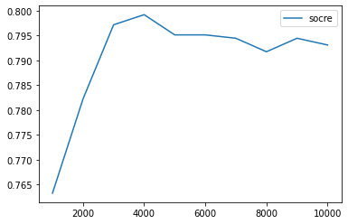
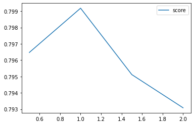
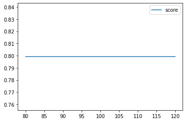
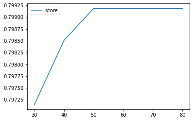

# 「より良い」機械学習モデルの構築方法を学べるレシピ

## レシピの概要

このレシピは、「より良い」機械学習モデルの構築方法を学べるレシピです。

「より良い」機械学習モデルとは、以下の条件を満たすものをさします。

* 性能がよいこと
* 処理速度がはやいこと
* リソース使用量が少ないこと

このレシピでは、文章分類のタスクを通じて、
「より良い」機械学習モデルをつくるための改善方法を実戦的に学んでいきます。

### 前提知識

* python (基本構文であるif, for などが理解できる。)
* sklearn, pandasなどのライブラリを扱える(写経できる)
* 機械学習の教師あり学習の概念がわかる

### 達成できること

* 「より良い」に記載した3点の基準でモデル改善アプローチを実戦的に学べる
* 文章分類モデルの学習・評価の基礎がわかる

## 材料・道具

### 実行環境
Google Colaboratory

### 道具

* python(3.5以上)
* sudachipy
* sudachidict-core
* sortedcontainers
* pandas
* matplotlib
* seaborn
* numpy
* scipy

### 材料

livedoor ニュースコーパス https://www.rondhuit.com/download.html#ldcc

## 良い機械学習モデルをつくるには何をするか

レシピ概要で記載したとおり、より良い機械学習モデルとは以下の3点をさします。

* 性能がよいこと
* 処理速度がはやいこと
* リソース使用量が少ないこと

|  項目  |  定義  |
| ---- | ---- |
| 性能がよいこと |  モデルの正解率、再現率、適合率といった指標で高い数値が出ている |
| 処理速度がはやいこと |  処理速度が早く、なるべく低リソースで動作する |
| リソース使用量が少ないこと |  少ないリソース(メモリ、CPU)で動作すること |

3つの項目のうち、何を重視すべきかは、タスクによって異なります。

このレシピでは、「処理速度」と「リソース使用量」の改善を重視に取り組んでいきます。   
※ 多くの機械学習系の記事は、性能を重視した記事が多いので、この2つにしました。  

ただ単に最終系のコードを提示するだけでなく、改善の過程も残しています。  
実務に役立つノウハウを提供できれば、幸いです。

## 調理

### 道具の準備

必要な道具と材料をそろえます。

まず道具ですが、ベースの動作環境は、Google Colaboratoryにだいたいのものは揃っているので、  
追加で用意する必要があるのは、形態素解析ツールであるsudachiのみになります。

* sudachipy
* sudachidict-core
* sortedcontainers

以下のコマンドでインストールしてください。

```
%%bash
pip install sudachipy==0.5.1 sudachidict-core==20201223.post1 sortedcontainers==2.1.0
```

インストール後は、Colaboratoryのメニューから"ランタイム>ランタイム" を再起動してください。    
※ 実施しないとインストールした道具がロードされないので注意

### 材料を揃える

livedoor ニュースコーパスのデータセットをダウンロード&&展開します。 

```
%%bash
wget https://www.rondhuit.com/download/ldcc-20140209.tar.gz
tar xzf ldcc-20140209.tar.gz
```

展開すると直下にディレクトリ`text`というディレクトリがあり、その下に9つのディレクトリがあります。 

```
topic-news
sports-watch
kaden-channel
smax
livedoor-homme
it-life-hack
dokujo-tsushin
peachy
movie-enter
```

個々のディレクトリにはニュース記事が入っています。 

```
# 独女通信の例
./text/
├── CHANGES.txt
├── dokujo-tsushin
│   ├── dokujo-tsushin-4778030.txt
│   ├── dokujo-tsushin-4778031.txt
│   ├── dokujo-tsushin-4782522.txt
│   ├── dokujo-tsushin-4788357.txt
│   ├── dokujo-tsushin-4788362.txt

```

### データセットの準備

livedoorのニュース記事を対応するカテゴリに分類していくタスクに取り組みます。   
そのためのデータセットを準備します。 

```python
import os

#
# テキスト直下のディレクトリ一覧を取得(これがカテゴリになる。)
#
dirlist = os.listdir('text')
category_list = {}
i=0
for dirname in dirlist:
    if dirname[-3:] != 'txt':
        category_list[str(i)] = dirname
        i+=1

#
# データセットを作成して、ファイルに出力する。
#　　ファイルはtsv形式で、ファイル名、ラベルid、カテゴリ名、テキストを出力する。
#
with open('dataset.tsv', 'w') as f_out:
    for label, category in category_list.items():
        path = './text/{}/'.format(category)
        filelist = os.listdir(path)
        filelist.remove('LICENSE.txt')
        for filename in filelist:
            with open(path + filename, 'r') as f_in:
                # テキストはタイトルのみ取得　(本文は学習対象にしない)
                text = f_in.readlines()[2]
                # カラム生成
                out_row = [filename, label, category, text]
                f_out.write("\t".join(out_row))
```

`dataset.tsv`というファイルが生成されて、以下のようなデータがあれば、成功です。 

```
topic-news-6612237.txt	0	topic-news	神戸「サンテレビ」、プロ野球中継で放送事故
topic-news-6298663.txt	0	topic-news	フジで午後のワイドショーが復活、韓流推し反対デモの影響は「関係ない」に物議
topic-news-6625187.txt	0	topic-news	「全てのトイレを和式に」 野村ホールディングス株主の珍提案が海外で話題に
topic-news-6118456.txt	0	topic-news	女性教授が男子生徒に「なめるな」「テクニシャン」などと発言し提訴される
topic-news-6657046.txt	0	topic-news	「週刊文春」でAKB指原交際報道、衝撃内容にファン「絶対許さない」
```

データをpandasでロードします。  
ロード時は必ずランダムサンプリングを実施してください。   
実施しない場合は、データに偏りが出て、正確な検証ができなくなります。  
```python
import pandas as pd
df = pd.read_table(
    'dataset.tsv',
    names=['filename', 'label', 'category', 'text']
    ).sample(frac=1, random_state=0).reset_index(drop=True)
```
最後にデータを学習:テスト用=8:2に分割して完了です。 

```python
#
# データを学習:テスト用=8:2に分割
#
N = len(df)
train_df = df[:int(N * 0.8)] # 学習
test_df = df[int(N * 0.8):] # テスト
```

### ベースラインを決める

本記事の目的は、「より良い」機械学習モデルをつくるための改善方法を学ぶところにあります。     
そこで、まずはベースラインとなるモデルを作り、ベースラインのモデルに対して、 
改善のアプローチをとっていくことにしていきます。

ベースラインとして設定が必要なのは、「前処理」と「文章分類ツール」です。 

今回は、以下の条件をベースラインとします。

```
# 前処理
テキストの加工処理は、sudachiによるトークン化のみとする。　
正規化やストップワード除去などは、実施しない。
文章ベクトルは、Bag-of-Word形式とする。 
```


```
# 文章分類ツール
sklearnのロジスティック回帰をツールとして使う。
ハイパーパラメータは、デフォルトの状態とする。　
```

なお、ベースラインの前処理コードは、以下を使います。

```python
from unicodedata import normalize
from sudachipy import tokenizer
from sudachipy import dictionary
import string

from sklearn.feature_extraction.text import CountVectorizer

#
# 前処理
#
class TextPreprocessing(object):
    def __init__(self):
        self.tokenizer_obj = dictionary.Dictionary().create()
        self.mode = tokenizer.Tokenizer.SplitMode.A
        self.vectorizer = CountVectorizer()

    #
    # テキストに対して前処理を実施
    #
    def _preprocess(self, text): 
        # トークン化
        morphs = []
        for m in self.tokenizer_obj.tokenize(text, self.mode):
            morphs.append(m.surface())

        return " ".join(morphs)

    #
    # 文章データの行列を生成(各文章に対するベクトル一覧)
    #
    def get_matrix(self, text_series, mode='train'):
        text_series = text_series.map(self._preprocess)

        if mode == 'train':
            # 辞書作成と文章データの行列を作成
            bag = self.vectorizer.fit_transform(text_series)
        else:
            # 文章データの行列を作成 ※ 辞書はtrainでつくったものを使用
            bag = self.vectorizer.transform(text_series)

        return bag

```

### ベースラインの評価

ベースラインに対して、「より良い」モデルの基準に対応する評価を実施します。

性能は、テストデータに対する正解率(accuracy)評価します。 

処理速度は、以下の時間を評価対象します。 

* 学習データに対する前処理の時間
* 学習時間

リソース使用量は、Colaboratoryでの定量取得が難しいため定量評価はなしとします。 

上記の条件で、評価した結果以下のとおりとなりました。 
※ 処理時間は、`%%time`で計測した、`user`の時刻としています。　

* 学習データに対する前処理の時間: 14.2s
* 学習時間: 82s
* 正解率: 0.8005427408412483

評価に使ったコードは、それぞれ以下の通りです。　

```python
%%time
tp = TextPreprocessing()
bag = tp.get_matrix(train_df.text)
train_X = bag.toarray()
train_y = pd.Series(train_df.label)
```

```python
%%time
from sklearn.linear_model import LogisticRegression

clf = LogisticRegression()
clf.fit(train_X, train_y)
```

```python
bag_test = tp.get_matrix(test_df.text, mode='test')
test_X = bag_test.toarray()
test_y = pd.Series(test_df.label)
score = clf.score(test_X, test_y)
print(score)
```

### スパース行列の利用

ここから改善タスクに入っていきます。   
まずは、文章行列である`train_X`をスパース行列型に変更します。 

今回はBag-of-Word形式で文章ベクトルを生成しています。  
Bag-of-Wordで作った文章行列は性質上0を大量に含んだ行列なります。  

```python
print(train_X)
# -> out
#[[0 0 0 ... 0 0 0]
# [0 0 0 ... 0 0 0]
# [0 0 0 ... 0 0 0]
# ...
# [1 0 0 ... 0 0 0]
# [0 0 0 ... 0 0 0]
# [0 0 0 ... 0 0 0]]

```

この特徴を持つ行列は、`scipy`のスパース行列に変換すると、メモリ削減・処理速度向上の効果があります。   
そこで、スパース行列に変換したうえで、学習させてみます。

```python
from scipy.sparse import lil_matrix
from sklearn.linear_model import LogisticRegression

train_X = lil_matrix(train_X) # スパース行列に変換

clf = LogisticRegression()
clf.fit(train_X, train_y)
```

すると学習時間が82s -> 3.6s に大幅に縮まりました。

### 前処理改善(1)

処理速度とメモリ使用量をさらに改善するために、テキストの前処理の改善をしていきます。  
改善ポイントは、**性能に極力影響を及ばさない範囲**で語彙数を削減することです。  
どの程度を極力とするのかは、タスクによりますが、今回は1%以内と設定します。 

具体的には、以下の改善を実施していきます。

* ユニコード正規化
* 記号などのノイズ除去
* アルファベットは小文字に統一
* 品詞選択(名詞のみを使用)
* 数値除去

```python
from unicodedata import normalize
import string
from sudachipy import tokenizer
from sudachipy import dictionary

from sklearn.feature_extraction.text import CountVectorizer

#
# 前処理
#
class TextPreprocessing(object):
    def __init__(self):
        self.tokenizer_obj = dictionary.Dictionary().create()
        self.mode = tokenizer.Tokenizer.SplitMode.A
        punctuation = string.punctuation + '。、×÷ 【】『』 「」”“'
        self.noises = str.maketrans(
            {k: ' ' for k in normalize('NFKC', punctuation)})
        self.vectorizer = CountVectorizer()


    #
    # ユニコード正規化を実施したうえで、トークン化を実施
    #
    def _preprocess(self, text):
        # unicode正規化と記号除去
        text = normalize('NFKC', text).lower()
        text = text.translate(self.noises).strip()
 
        # トークン化
        morphs = []
        for m in self.tokenizer_obj.tokenize(text, self.mode):
            if m.part_of_speech()[0] == '名詞' and m.part_of_speech()[1] != '数詞':
                morphs.append(m.surface())
        return " ".join(morphs)


    #
    # 文章データの行列を生成(各文章に対するベクトル一覧)
    #
    def get_matrix(self, text_series, mode='train'):
        text_series = text_series.map(self._preprocess)
        if mode == 'train':
            # 辞書作成と文章データの行列を作成
            bag = self.vectorizer.fit_transform(text_series)
        else:
            # 文章データの行列を作成 ※ 辞書はtrainでつくったものを使用
            bag = self.vectorizer.transform(text_series)

        return bag

```
この改善を実施した結果の評価は以下の通りとなっています。 

* 学習データに対する前処理の時間: 14.2s -> 13.3s
* 学習時間: 3.6s -> 2.93s
* 正解率: 0.8005427408412483 -> 0.7930800542740841

わずかですが、前処理や学習時間の短縮に成功しています。                
性能がやや劣化していますが、1%以内なので許容範囲とします。 

### 前処理改善(2)

`CountVectorizer`の`max_features`を調整することで、語彙を減らすアプローチをとってみます。     
ちなみに、現状は、`max_features`はNoneであるため、学習データの中のすべての語彙が使用されている状態です。 

学習データの語彙数がいくつあるかを調べるには、`CountVectorizer`の`vocabulary_`をみればわかります。 

```python
d = tp.vectorizer.vocabulary_
print(len(d)) # out -> 9463
```
語彙数は9463あることがわかりました。   
語彙数を減らせば学習時間を減らすことが期待できますが、正解率が低下するリスクがあります。   
そこで、1000〜最大(9463)の範囲で正解率がどのくらい変化していくかみていきましょう。

まずは、前処理のクラスにmax_featuresを指定できるように変更をいれます。 

```python
from unicodedata import normalize
import string
from sudachipy import tokenizer
from sudachipy import dictionary

from sklearn.feature_extraction.text import CountVectorizer

#
# 前処理
#
class TextPreprocessing(object):
    def __init__(self, max_features=None):
        self.tokenizer_obj = dictionary.Dictionary().create()
        self.mode = tokenizer.Tokenizer.SplitMode.A
        punctuation = string.punctuation + '。、×÷ 【】『』 「」”“'
        self.noises = str.maketrans(
            {k: ' ' for k in normalize('NFKC', punctuation)})
        # max_featuresを追加
        self.vectorizer = CountVectorizer(max_features = max_features)


    #
    # ユニコード正規化を実施したうえで、トークン化を実施
    #
    def _preprocess(self, text):
        # unicode正規化とノイズ除去
        text = normalize('NFKC', text).lower()
        text = text.translate(self.noises).strip()

        # トークン化
        morphs = []
        for m in self.tokenizer_obj.tokenize(text, self.mode):
            if m.part_of_speech()[0] == '名詞' and m.part_of_speech()[1] != '数詞':
                morphs.append(m.surface())
        return " ".join(morphs)


    #
    # 文章データの行列を生成(各文章に対するベクトル一覧)
    #
    def get_matrix(self, text_series, mode='train'):
        text_series = text_series.map(self._preprocess)
        if mode == 'train':
            # 辞書作成と文章データの行列を作成
            bag = self.vectorizer.fit_transform(text_series)
        else:
            # 文章データの行列を作成 ※ 辞書はtrainでつくったものを使用
            bag = self.vectorizer.transform(text_series)

        return bag

```

1000から10000まで1000きざみで正解率の変化をみていきます。 

```python
from sklearn.linear_model import LogisticRegression
import matplotlib.pyplot as plt

candidate = list(range(1000, 11000, 1000))
clf = LogisticRegression()
scores = []
for max_features in candidate:
    tp = TextPreprocessing(max_features=max_features)
    bag = tp.get_matrix(train_df.text)
    train_X = bag.toarray()
    train_y = pd.Series(train_df.label)
    clf.fit(lil_matrix(train_X), train_y)

    bag_test = tp.get_matrix(test_df.text, mode='test')
    test_X = bag_test.toarray()
    test_y = pd.Series(test_df.label)
    scores.append(clf.score(lil_matrix(test_X), test_y))

plt.plot(candidate, scores, label='socre')
plt.legend()
```



グラフを見ると語彙数が4000件で頭打ちになっていることがわかります。 

よって、`max_features`は4000件とします。

`max_features`は4000件としたときの評価は以下の通りです。

* 学習データに対する前処理の時間: 13.3s -> 13.8s
* 学習時間: 2.93s -> 1.7s
* 正解率: 0.7930800542740841 -> 0.7991858887381276

前処理の処理時間が若干上昇してしまっています。   
`CountVectorizer`に`max_features`を指定したことで、処理内容が増えたことが考えられます。   
ただ、学習時間は減少しているので、トータルの処理時間は短縮できています。

### ハイパーパラメータのチューニング

最後にハイパーパラメータのチューニングです。   
ハイパーパラメータは、性能向上の目的がメインです。   
前処理で若干落ちた性能を少しでも向上させるためにチューニングしていきます。

今回は、特に性能改善効果がある以下の2つのパラメータを制御していきます。

* C
* max_iter

Cは正則化の逆数を表すパラメーターで過学習を制御するためのパラメータです。   
デフォルトが1.0だったので、付近の値で最も高い正解率が出るパラメータを選定していきます。 

```python
import matplotlib.pyplot as plt

C_candidate = [0.5, 1.0, 1.5, 2.0]
scores = []
train_X=lil_matrix(train_X)
test_X=lil_matrix(test_X)


for c in C_candidate:
    clf = LogisticRegression(C=c)
    clf.fit(train_X, train_y)
    scores.append(clf.score(test_X, test_y))

plt.plot(C_candidate, scores, label='score')
plt.legend()
```



デフォルトの1.0付近が最もよい結果となりそうです。

次にmax_iterです。    
最大学習回数を示すパラメーターです。

デフォルトが100であったので、Cと同様に付近の値で検証してきます。

```python
import matplotlib.pyplot as plt

iter_candidate = [80, 90, 100, 110, 120]
scores = []
train_X=lil_matrix(train_X)
test_X=lil_matrix(test_X)

for iter in iter_candidate:
    clf = LogisticRegression(max_iter=iter)
    clf.fit(train_X, train_y)
    scores.append(clf.score(test_X, test_y))

plt.plot(iter_candidate, scores, label='score')
plt.legend()
```
すると下記の通り、まったく同じ正解率となりました。　



そこで、もう少しmax_iterの値を落として、`[30, 40, 50, 60, 70, 80]`で検証してみます。  
すると50付近で頭打ちになることがわかりました。　




### グリッドサーチによるチューニング

より良いハイパーパラメータを選定するため、グリッドサーチによるハイパーパラメータを絞り込みます。　

前の結果までで、C=1.0, max_iter=50付近で最大の正解率が得られることがわかってます。   
なので、C=1.0, max_iter=50付近の値で組み合わせを選択し、最大の正解率を得られるパラメーターを探索します。

```python
import itertools
import warnings

warnings.simplefilter('ignore')
train_X=lil_matrix(train_X)
test_X=lil_matrix(test_X)

#
# グリッドサーチによるパラメーター探索を実装した関数
#
def search_best_param(grid_param,  estimator, verbose=False):
    best_acc = 0
    best_param = {}
    product = [x for x in itertools.product(*grid_param.values())]
    params = [dict(zip(grid_param.keys(), r)) for r in product]
    for param in params:
        estimator.set_params(**param)
        estimator.fit(train_X, train_y)
        acc = clf.score(test_X, test_y)
        if verbose:
            print(param, acc)
        if  acc > best_acc:
            best_acc = acc
            best_param = param
    return best_param, best_acc


candidate = []
# 探索するパラメーターの組み合わせ
grid_param = {
    "C": [0.8, 0.9, 1.0, 1.1, 1.2],
    "max_iter": [45, 50, 55]
    }
clf = LogisticRegression()
candidate.append(search_best_param(grid_param, clf))

best_param, best_score = sorted(candidate, key=lambda x: x[1], reverse=True)[0]
print(best_param, best_score) # 最大スコアを出したパラメーターとスコア
```

探索の結果、`best_param`が`{'C': 0.8, 'max_iter': 50}`でスコアは0.7998643147896879となりました。    
若干の改善ですが、チューニング前よりスコアが向上しています。 

また、このパラメータで学習を実施すると学習時間は、短縮していることがわかります。
`max_iter`の値をデフォルトより小さくできたためです。 

評価をまとめると、以下のとおりです。 

* 学習データに対する前処理の時間(処理内容に変更なし): 13.8s -> 13.8s 
* 学習時間: 1.7s -> 1.15s
* 正解率: 0.7991858887381276 -> 0.7998643147896879

### まとめ　

今回は、「より良い」機械学習モデルの構築として、処理速度改善とリソース使用量削減に取り組みました。  
具体的に実施した内容は以下の通りです。

* スパース行列の利用
* 前処理改善
* ハイパーパラメータのチューニング

最終評価として、ベースラインに対して以下の成果を得ることができました。　

* 学習データに対する前処理の時間(処理内容に変更なし): 14.2s -> 13.8s 
* 学習時間: 82s -> 1.15s
* 正解率: 0.8005427408412483-> 0.7998643147896879

性能を保ちつつ、学習時間の大幅短縮に成功することができました。     
また、定量てきな評価はできていないですが、「スパース行列」と「前処理改善」は、 
メモリ使用量の削減につながっています。

かなり基礎的な学習をするとレシピとなりましたが、業務に役立つ情報になっていれば幸いです。 

